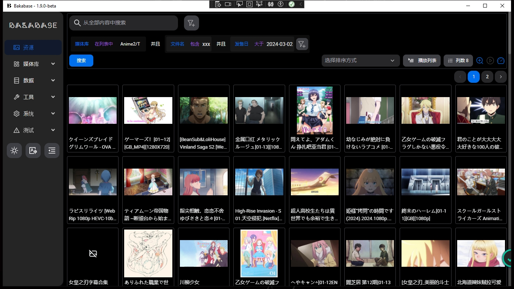
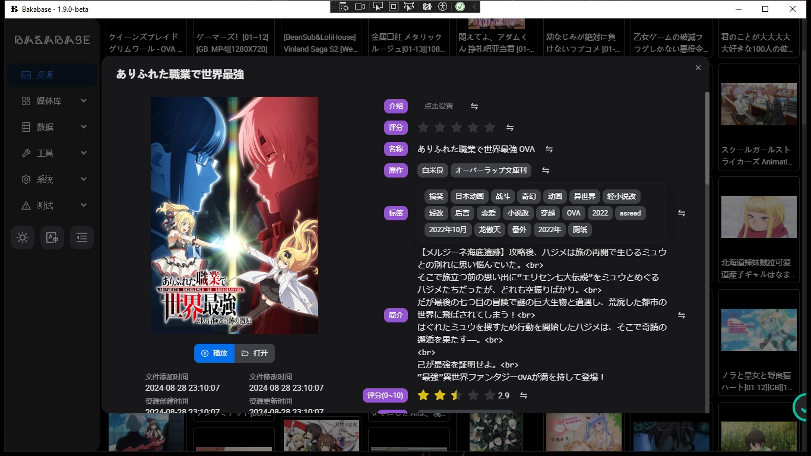
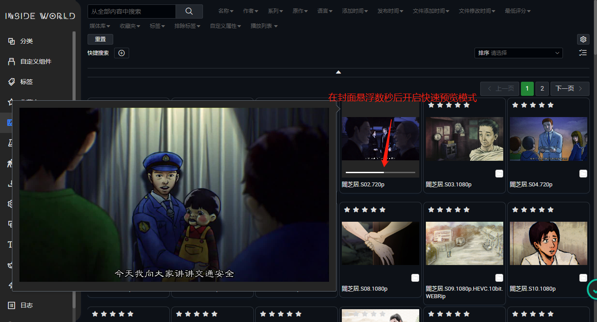
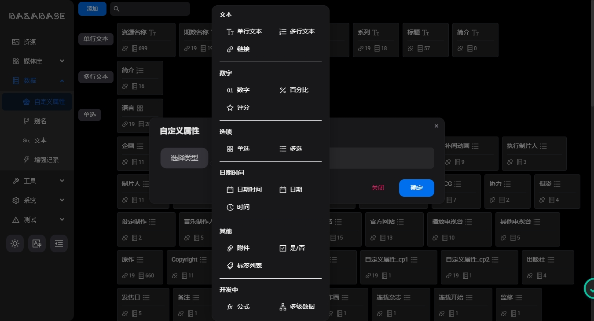
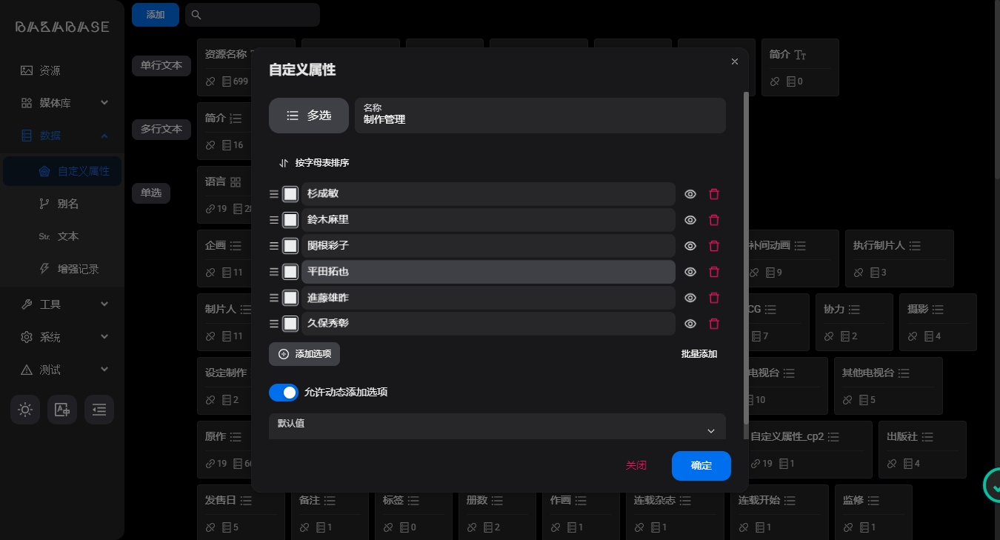
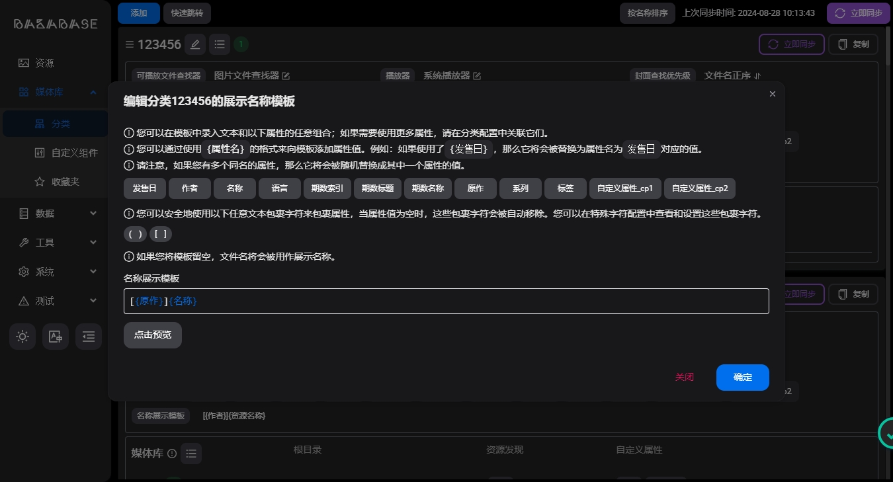
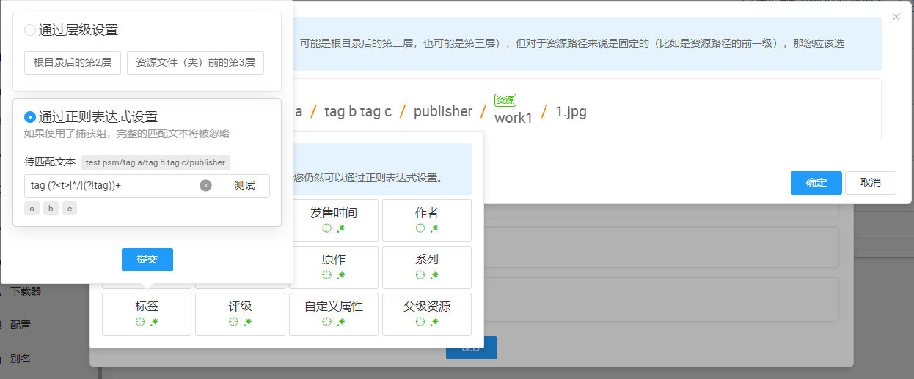
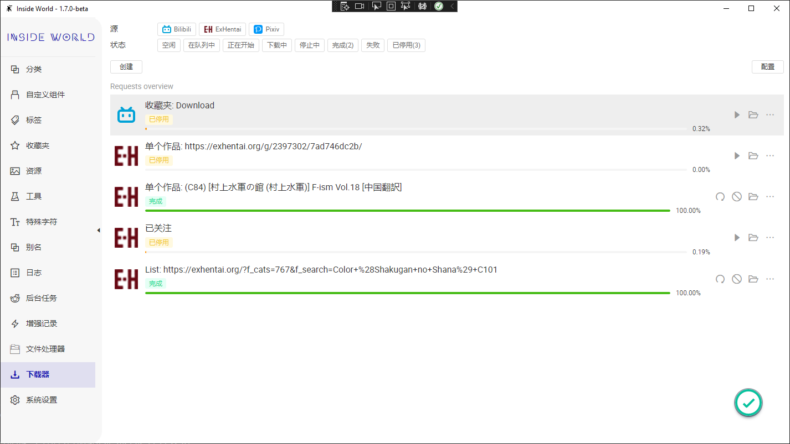

中文|[English](/README-en.md)

~~Inside World~~ Bakabase 是一款离线媒体管理库，用于本地媒体快速处理、搜索、预览与播放。

目前支持动画、漫画、音声、本子、电影、图集等媒体的管理，老司机食用效果更加哦~

本项目源自于本人自用软件，喜欢本软件的话请右上角star，并大力推荐给自己的朋友，感谢大家的支持。

更多内容请访问[项目首页](https://inside-world.anobaka.com/)

## 功能预览

## 如何参与

您可以查看开发文档(https://inside-world.anobaka.com/#/dev/dev)

## Star History

)
