## 管理分类 <!-- {docsify-ignore} -->

在正式管理资源前，你至少需要创建并配置一个分类。分类可以拖拽排序。
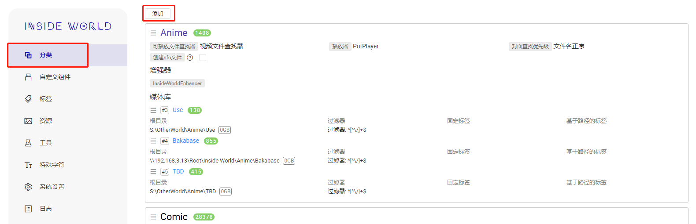

## 配置向导(v1.7.0+)

v1.9.0已移除

在1.7.0以后，可以使用配置向导进行分类配置，以下仅展示部分流程，具体流程和说明以软件内提示为准。

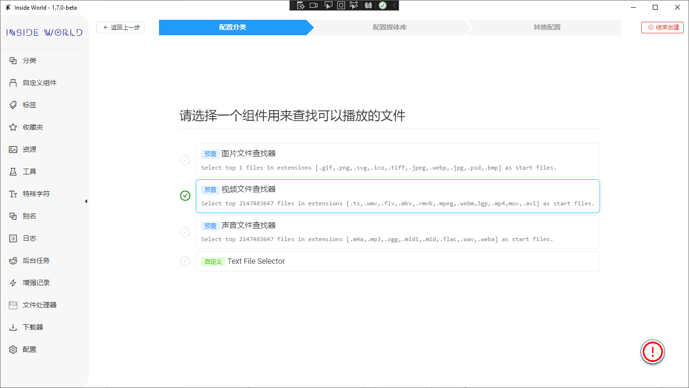
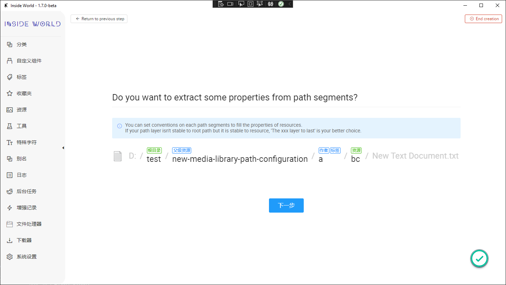
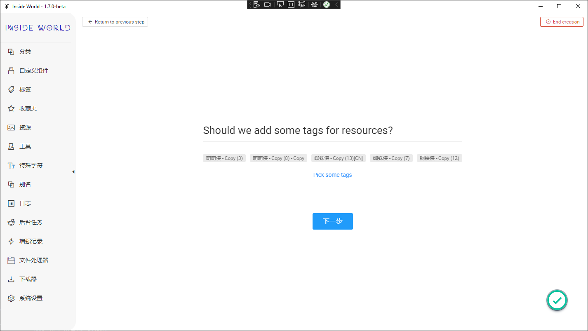
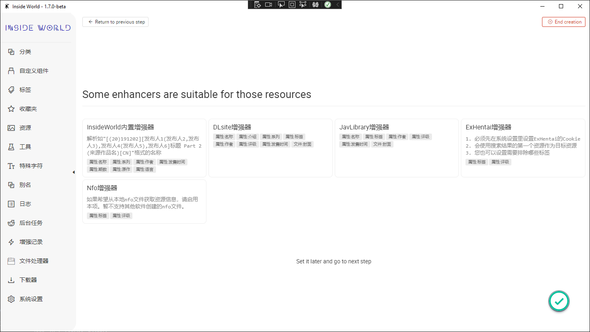
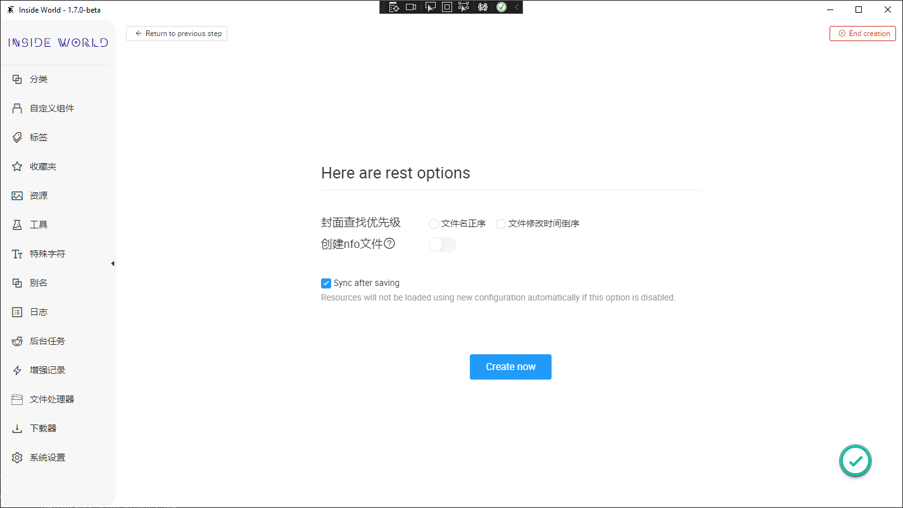

## 匹配资源路径(高级)(v1.7.1+)

现在可以进行更为复杂的资源路径配置

### 1. 基础概念

+ **根目录**：仅且必须设置一个，仅能通过`路径`设置；
+ **资源**：仅且必须设置一个，可以通过`路径`或`正则表达式`设置；
+ **其他属性**：可不设置，可通过`路径`或`正则表达式`设置，如果该属性不能超过`1个`，则会默认使用第一个匹配到的结果；
+ **通过路径配置**：可以通过在`根目录`和`资源`之间，正序或倒序的目录层级来设置属性；
+ **通过正则表达式配置**：可以通过匹配在`根目录`和`资源`之间的路径字符串来设置属性；

### 2. 设置界面

当属性不可用时，可以将鼠标移至不能设置的属性按钮上的设置方式来查看原因，有些提示也会出现在完整路径的正上方或正下方；

**可用性提示**

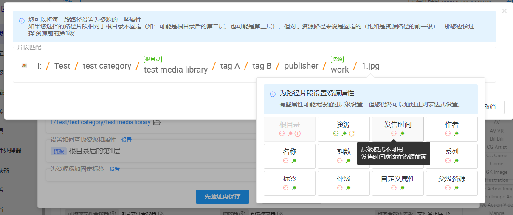

**通过层级设置**

**通过正则设置**

一些其他设置样例

+ 简单匹配全部文本

+ 匹配a和b
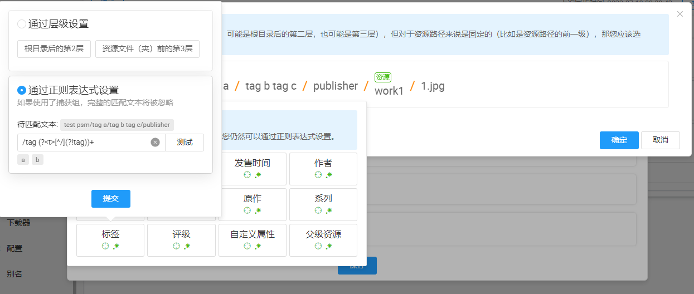

+ 匹配b和c

+ 匹配a、b和c

**设置结果**

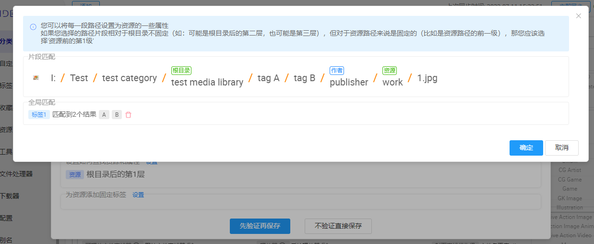

**使用本地资源预览**

## 基础配置

**封面查找优先级**

设置查找封面时候选图片列表的排序顺序（文件名正序、时间倒序），即下述优先级中2的选取规则，默认的封面查找优先级是：
1. 资源目录下名为cover（不包含后缀）的图片文件
2. 资源目录下的第一张图片（本项设置）
3. 资源目录下第一个视频中20%时间处的截图（默认关闭，在[系统设置](#configuration)中启用）
4. 资源目录下第一个压缩包内的第一张图片（默认关闭，在[系统设置](#configuration)中启用）

**创建nfo文件**

+ 启用后会创建本程序支持的nfo文件，用于跨设备共享部分信息；
+ 需要配合**nfo增强器**使用，并将其增强内容设置为最高优先级；

## 配置组件

**可播放文件查找器**

用于查找哪些文件是可被播放的，可以使用系统内置的查找器，也可以在[自定义组件](#custom-component)中创建自定义查找器

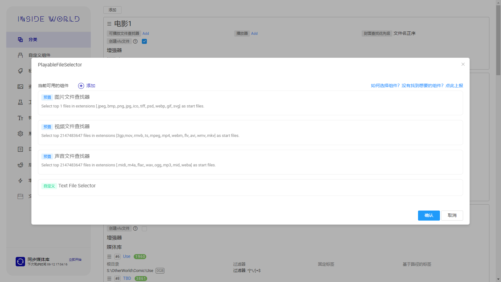

**播放器**

用于播放被`可播放文件查找器`找到的文件，可以在[自定义组件](#custom-component)中创建自定义播放器

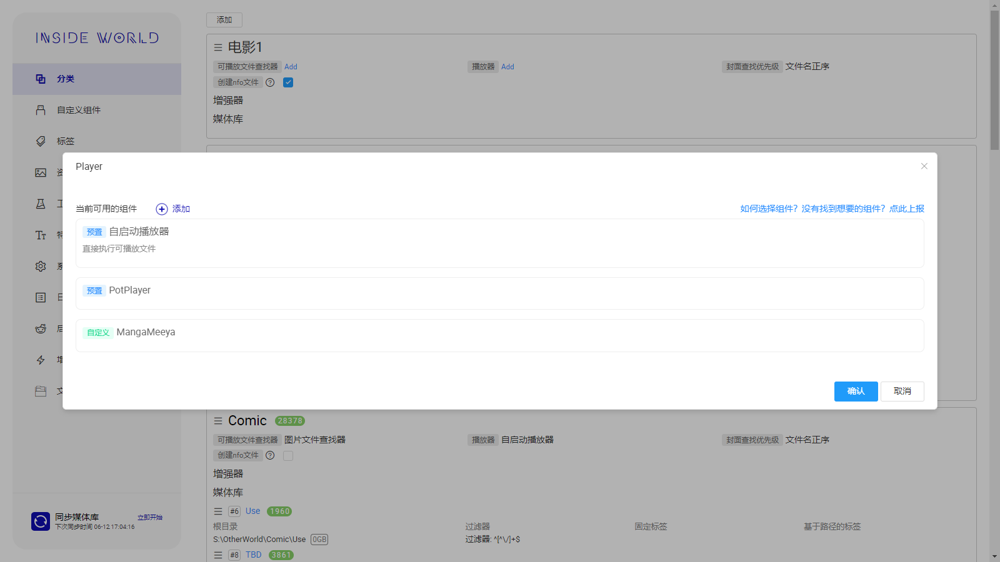

## 增强器

请参考[增强器](/guide/enhancer)

## 名称展示模板

## 媒体库

每个分类可以绑定多个媒体库，每个媒体库也能绑定多个系统目录。媒体库可以拖拽排序。

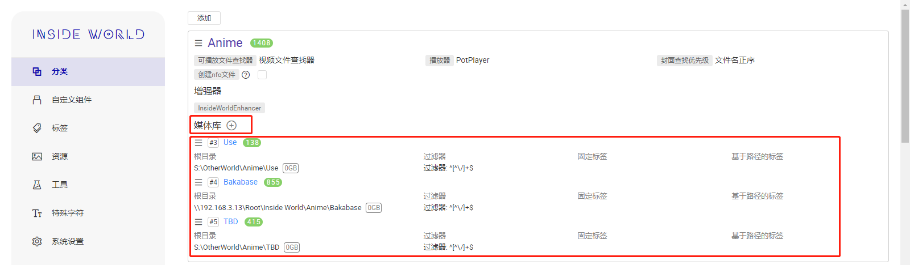
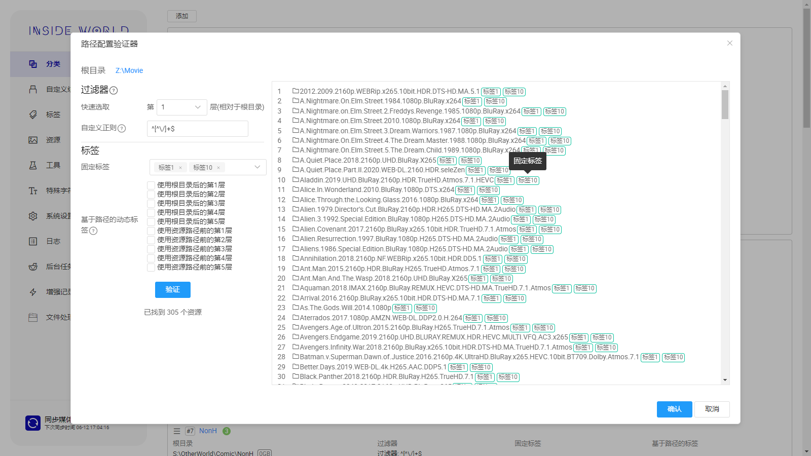

**根目录和过滤器**

本程序会将**根目录**下的全部文件(夹)通过**过滤器**筛选后剩余的文件(夹)视作**资源**
+ 如果你只是希望简单选择**根目录**下的某一层文件(夹)作为**资源**，则直接选择**第x层**即可；
+ 如果你希望根据复杂规则选择哪些文件(夹)会被视为**资源**，则可以通过手动填写正则表达式来完成；

**标签**

可以为当前根目录下的**资源**设置**默认标签**，用于快速筛选**资源**

+ 固定标签：所有当前根目录下的**资源**均会被添加所选标签；
+ 基于路径的动态标签：可以根据路径名称，动态为**资源**添加标签。假设根目录是`/电影`，资源路径是`/电影/漫威/蜘蛛侠`，如果选择了`使用根目录后第1层`或`使用资源路径的前1层`，则会为该资源增加`漫威`这个标签

**如何使用网络驱动器**

<a href="https://github.com/Bakabase/InsideWorld/issues/50" target="_blank">#50</a>
### 路径配置(v1.7.0+)
在1.7.0版本以后，你可以为媒体库根目录与资源文件之间的每一级目录配置属性。

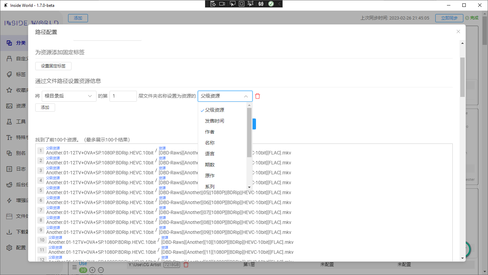

## 删除增强记录(v1.6.1+)

**删除分类下全部增强记录**

**删除媒体库下全部增强记录**

