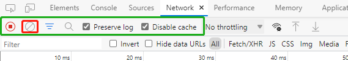
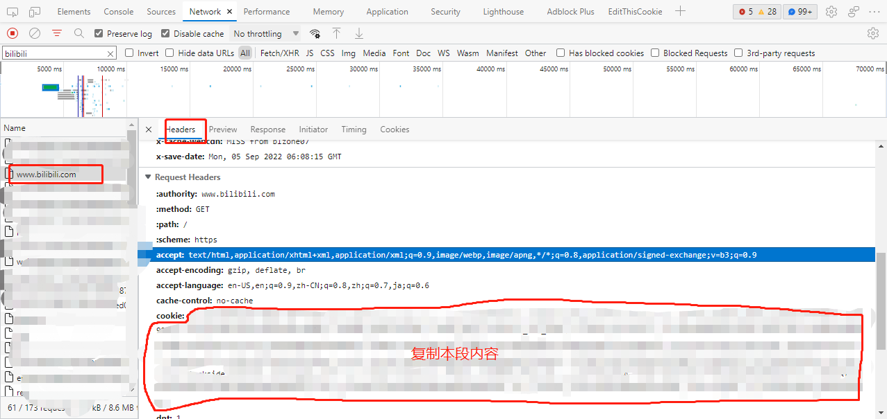

## 通用 <!-- {docsify-ignore} -->

## 获取cookie

在本项目所配置的cookie均为http协议包中的`原文cookie(urlencode后的)`，使用方式类似于：`curl --cookie '配置的cookie字符串' '请求地址'`。

以chrome和bilibili举例，如何获取cookie：

1. 进入b站首页；
2. 按F12打开开发者控制台；
3. 切换至【网络/network】模块；
4. 保持配置和下图绿框内一致，并且点击一次`红框的图标`清除已记录内容；

    
5. 按F5刷新页面；
6. 在开发者控制台的网络模块中，找到`www.bilibili.com`这条记录，点击它，右侧会显示详细内容。（如果是其他网站的cookie，找到对应网站域名的请求记录即可）；
7. 在详细内容 -【标头/Headers】中，下拉找到【请求标头/Request Headers】，在其中找到cookie这一项，复制冒号右侧全部内容；

    
8. 将复制的内容填入本软件相应的地方并保存即可；

## 数据迁移

所有和本机相关的数据文件均可以在`系统设置`-`数据保存路径`找到，将其复制或移动到您需要迁移到的新文件夹内即可完成迁移；

另：每次进行版本更新时，均会对历史全量数据进行一次备份，可以在`系统设置`-`备份路径`中找到它们。