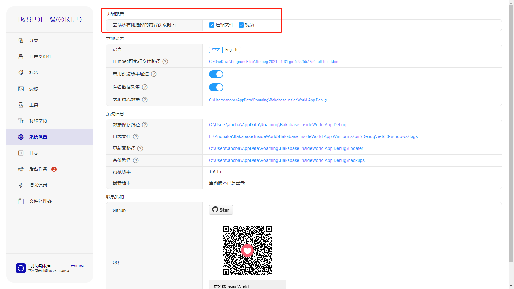
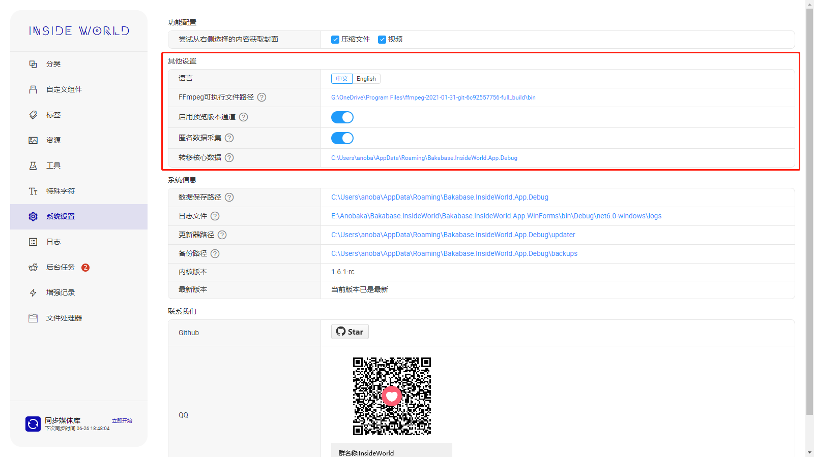
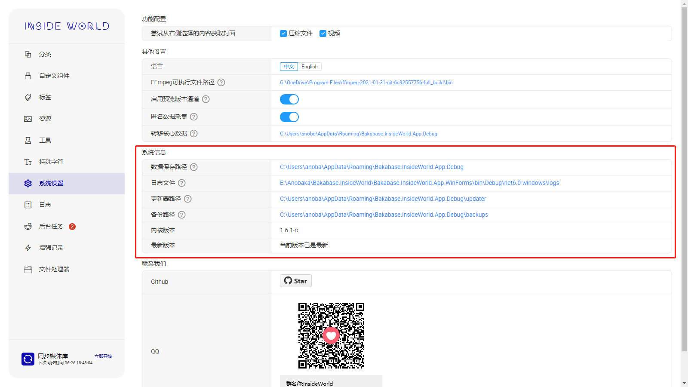

## 系统配置 <!-- {docsify-ignore} -->

## 功能配置

1. 这里可以增加封面来源，系统资源（cpu、内存等）占用程度从左往右从少变多
2. 在1.7.0版本以后，可以设置启动界面
3. 在1.7.1版本以后，可以设置全局代理

## 基础配置

**关于匿名数据采集**

目前仅采集以下内容

| 事件 | 数据 | 说明 |
|: - |: - |: - |
| 启动app | 启动时间，次数 |  |

不会记录任何个人隐私数据！任何数据的收集在系统设置里均可以关闭！

## 系统信息

