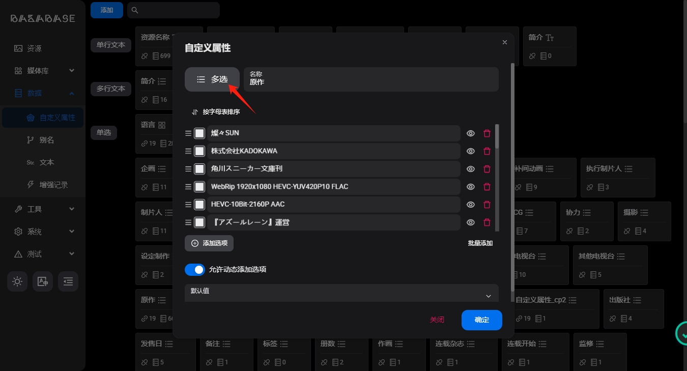
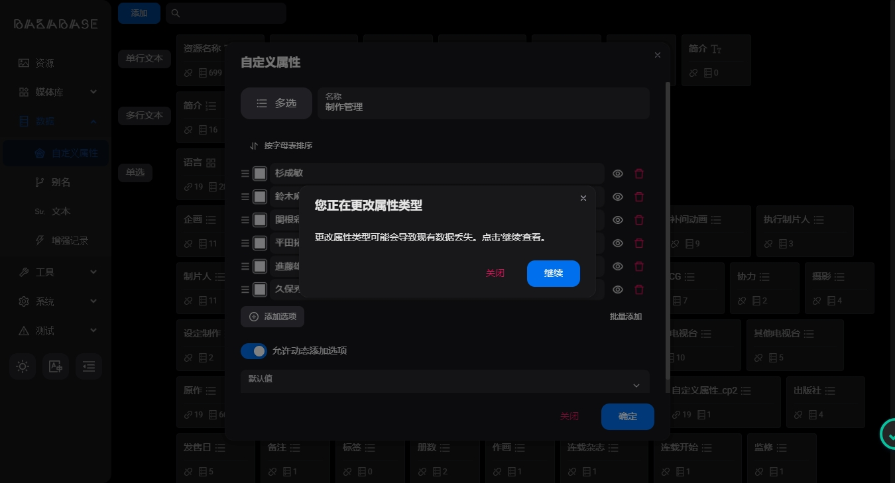
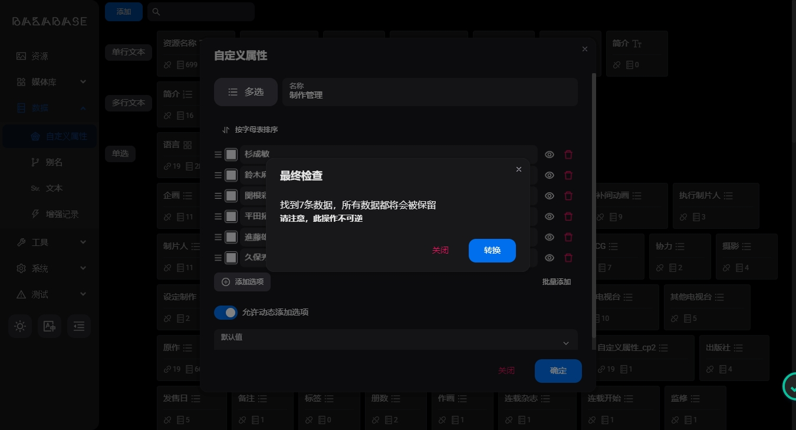
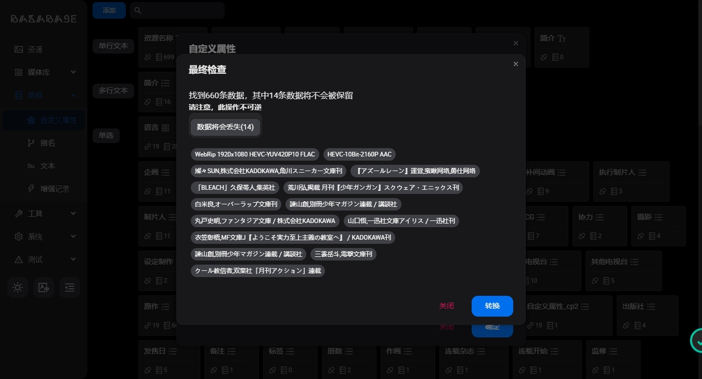
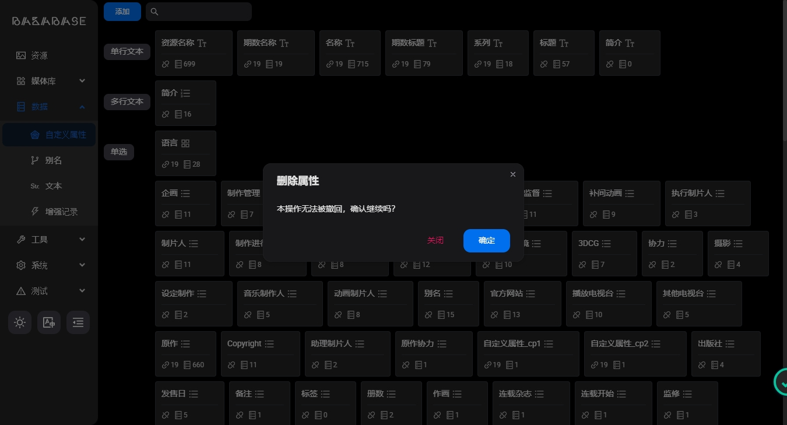

## 创建

从v1.9.0开始，您可以自由创建资源属性

您也可以为不同的属性配置内部规则和数据

## 属性类型转换

您可以将一个属性转换为另一个类型，**但是请注意，该操作具备一定的危险性，请谨慎操作。**

1. 打开需要转换的属性，点击左上角属性类型

2. 点击需要转换至的属性类型

3. 如果源类型和目标类型不能完全兼容，程序会提示您是否继续转换，您可以点击继续预览数据损失情况（此时不会发生转换）

4. 如果最终检查中显示所有数据均会被保留，则可以放心转换

否则请谨慎转换

5. 转换完成后，无需重新与资源或分类绑定；

## 删除
