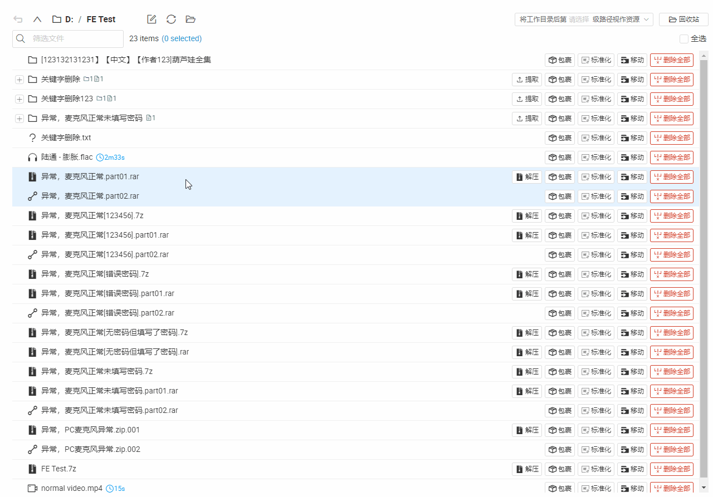
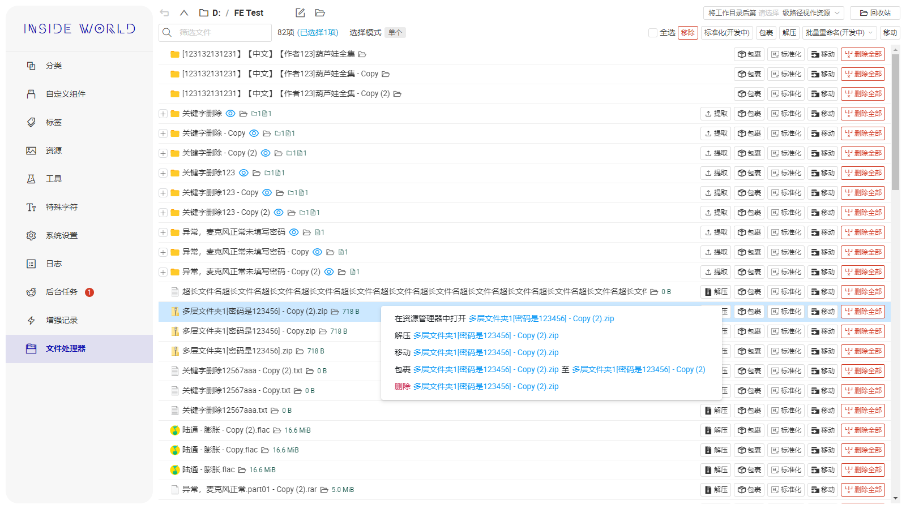
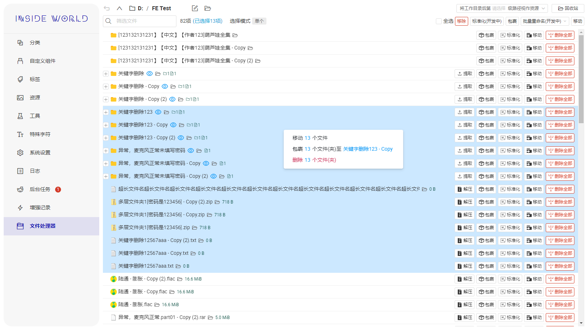
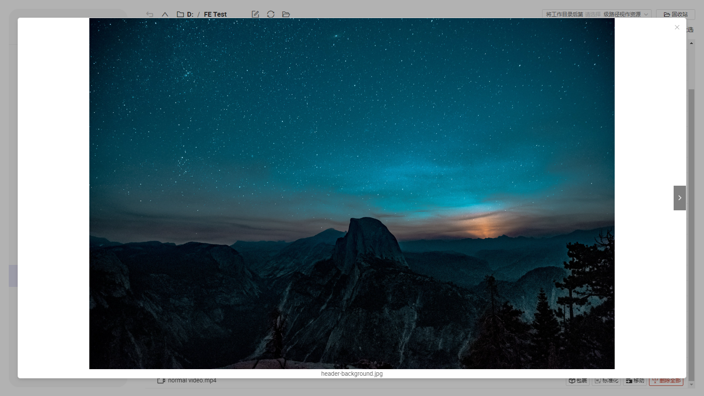
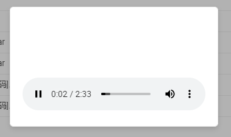
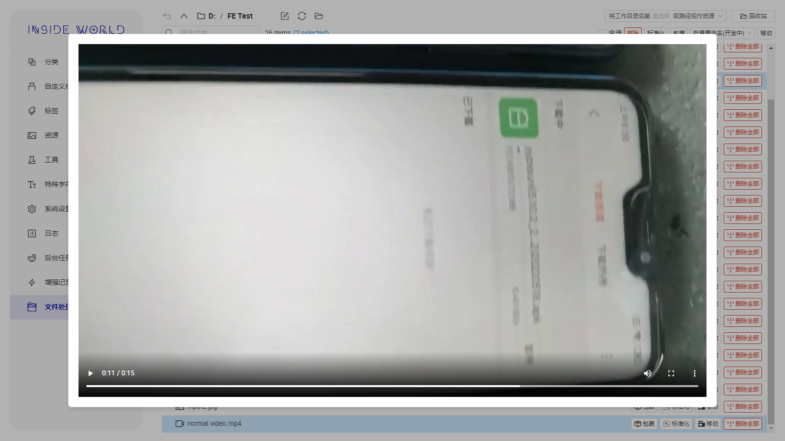
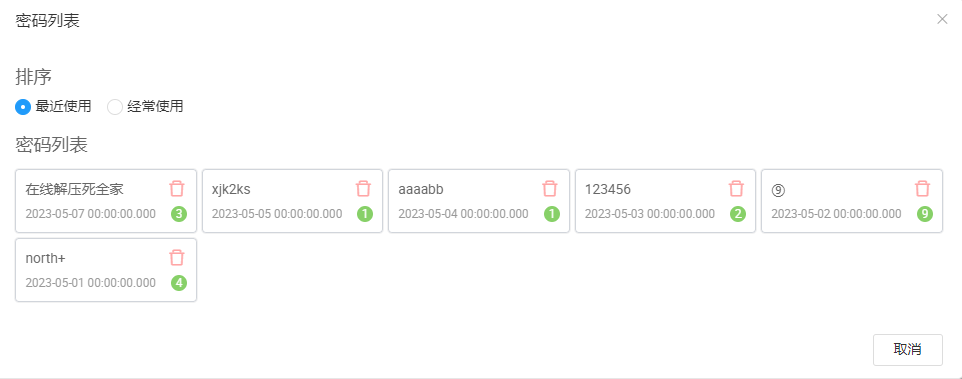
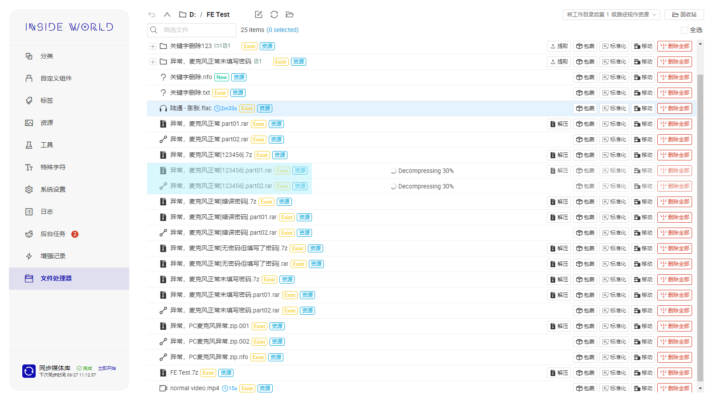
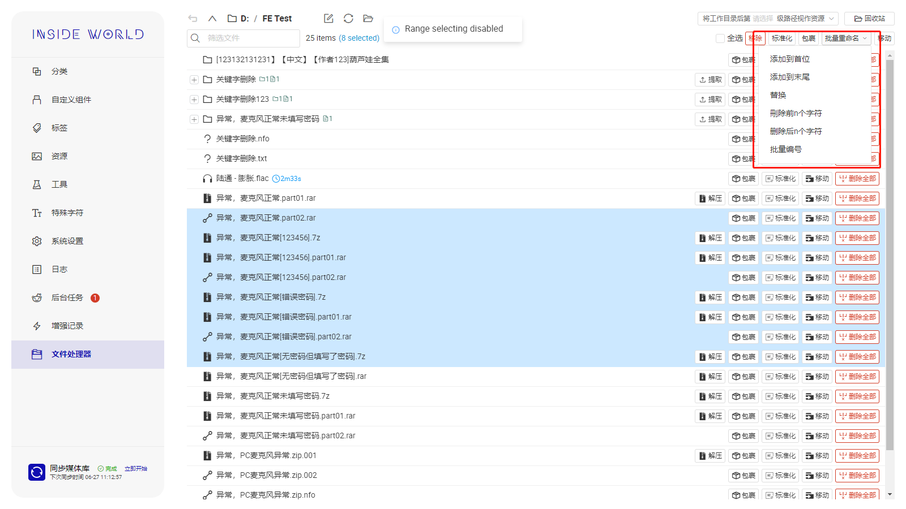

## 文件处理器(v1.6.1+，如果你疲于文件下载完成后的解压、移动、预览操作，请看这里) <!-- {docsify-ignore} -->

你是否有以下烦恼？

+ 下载的文件解压密码不同，每次解压都要复制粘贴一次密码；遗忘前面使用过的密码；
+ 下载的压缩文件后缀名不是标准压缩文件后缀（如.jpg，.zz，等防爆后缀），需要手动改后缀
+ 解压后有很多层没意义的文件夹，需要经常剪切粘贴
+ 不同动画的视频文件、字幕文件和封面都都在一个大文件夹里，需要手动一个个创建单独的文件夹
+ 想要预览文件的话，需要一个个文件夹点进去看
+ 预览完成后将各种文件移至对应的归档文件夹时，需要打开多个目标文件夹然后来回剪切粘贴
+ 下载的文件命名规则不统一，需要手动一个个改

如果你对以上操作感到厌烦，那么恭喜你，本功能就是你的处理利器！

## 基础功能

## 快速预览

**图片**

**音频**

**视频**

## 一键解压

可以通过点击**解压**按钮完成一键解压，如果文件名或目录后缀包含[xxxxx]，则会在解压时将`xxxxx`作为解压密码

**自动扫描解压密码**

会自动扫描路径中由[]包裹的字符串，将其作为可能的密码列在解压候选密码中

**使用和管理历史密码**

**解压进度**

## 将子文件(夹)提取至外层

可以将文件夹内的文件向外提取

## 将已选择的文件合并至文件夹

为所选文件(夹)创建外层文件夹，可以批量自动创建外层文件夹，也可以手动指定外层文件夹名称

## 删除同名文件

可以一键删除工作目录下全部同名文件

## 批量移动

可以将所选文件批量移动至某个**媒体库**

## 批量修改文件名(开发中)

