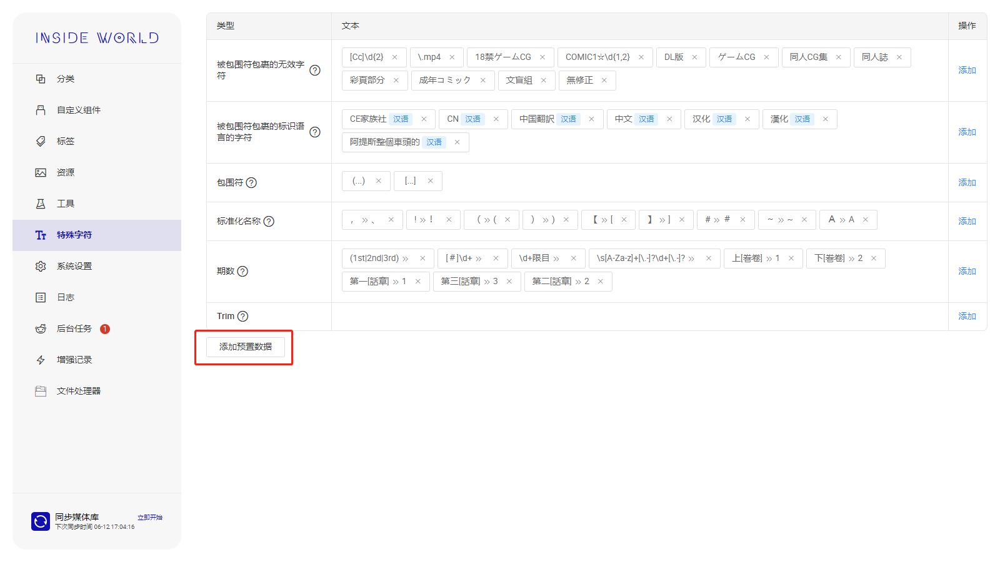

## 安装 <!-- {docsify-ignore} -->

在<a href="https://github.com/anobaka/InsideWorld/releases" target="_blank">Github Releases</a>下载最新版本压缩包并解压，然后通过`Bakabase.InsideWorld.exe`运行

## 初始化内置特殊字符集

**为确保能从资源名称中提取出更多的信息，强烈建议正式使用前配置该项**

