## 管理资源 <!-- {docsify-ignore} -->

管理和播放全部资源

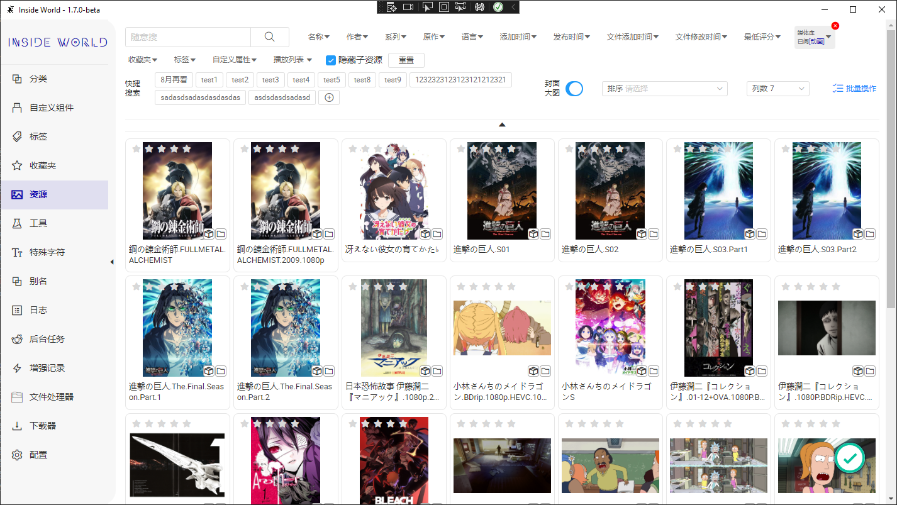

## 自定义筛选、排序和展示效果

1. 可以通过各种资源信息筛选资源
2. 可以将当前筛选条件保存下来，用于快速切换
3. 可以设置资源排序和排列样式

## 基础操作

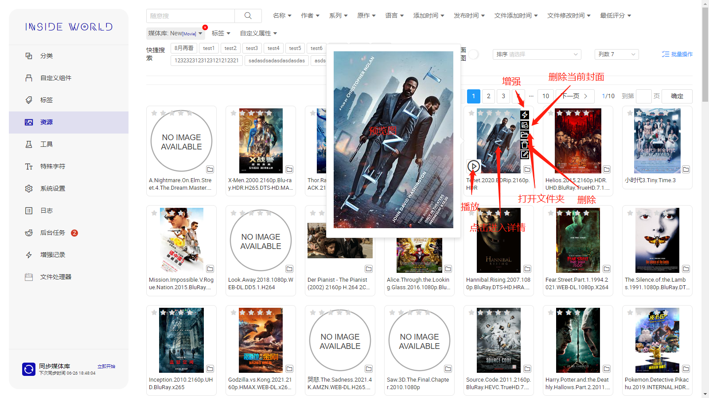

## 高级搜索(v1.6.3+)

**正则表达式**

随意搜现在支持使用正则表达式搜索，格式为：`reg:表达式内容`，使用空格和其他内容分开，如`冬月茉莉 reg:202\d`，将会搜索包含`冬月茉莉`关键词并且与正则`202\d`匹配的资源

## 快速预览(v1.7.2+)

鼠标在资源封面悬停数秒后开启快速预览模式，鼠标可以在下方快速调整进度条。

**需要在系统配置界面配置`FFMpeg`后才可以对视频资源快速预览。目前仅支持图片以及可直接在浏览器播放的视频（mp4等）**

## 预览、从视频截取封面(v1.6.2+)

可以快速预览资源，目前仅支持部分格式的文件。

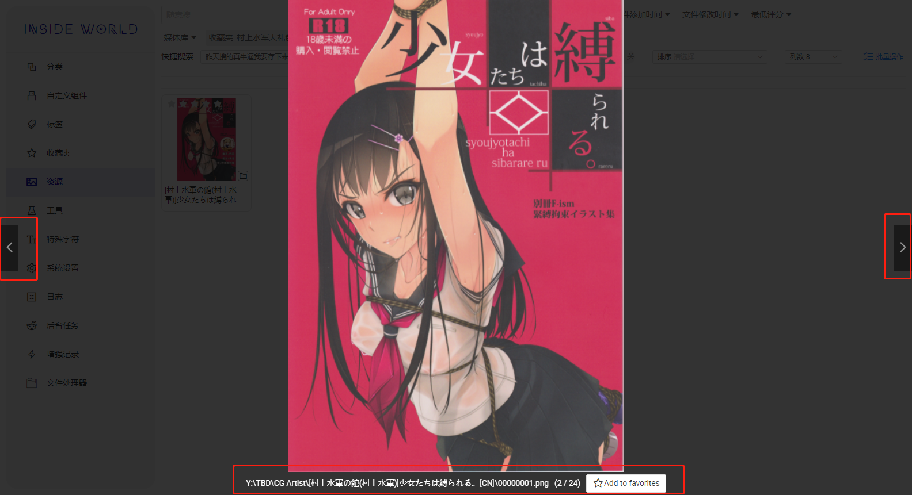

可以在预览时将该资源添加到收藏夹

## 设置封面(v1.7.2+)

可以在预览时为当前资源设置新封面

**视频资源在暂停时可截取图片作为新封面**

**图片资源可直接作为新封面**

## 批量操作

可以通过资源列表右上角进行批量选择资源，选择完成后可以进行以下操作：

> 在v1.7.0版本以后，可以通过shift进行多选

1. **在v1.6.1版本以后，为方便管理资源，可以批量移动资源至其他媒体库**

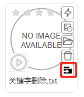
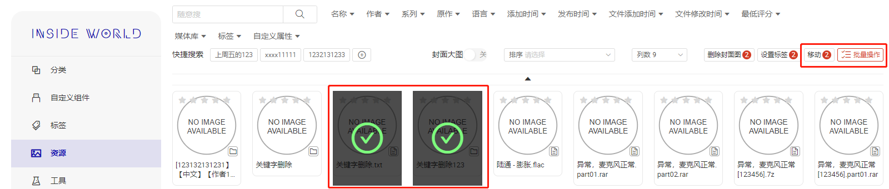
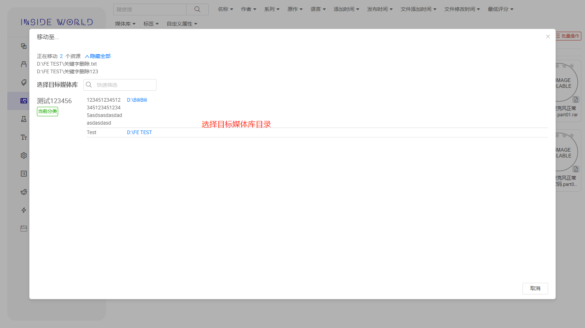
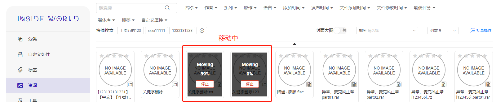

## 增强记录

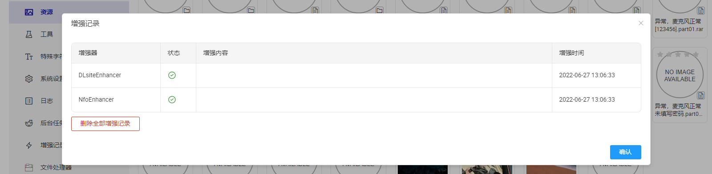

**增强信息举例**

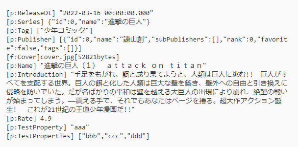

## 资源详情

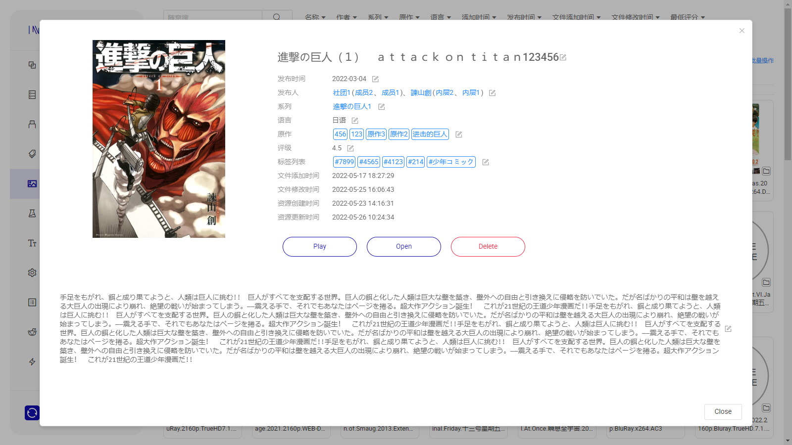
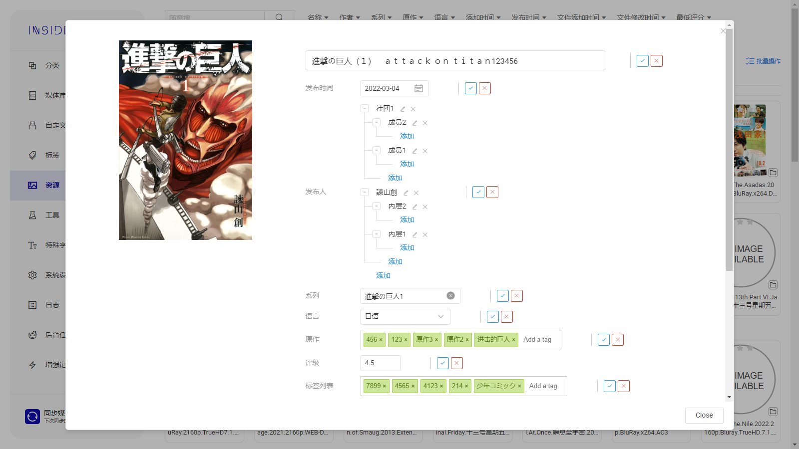

## 子资源和文件列表(v1.7.0+)

如果当前资源有关联的**子资源**，则会展示子资源列表

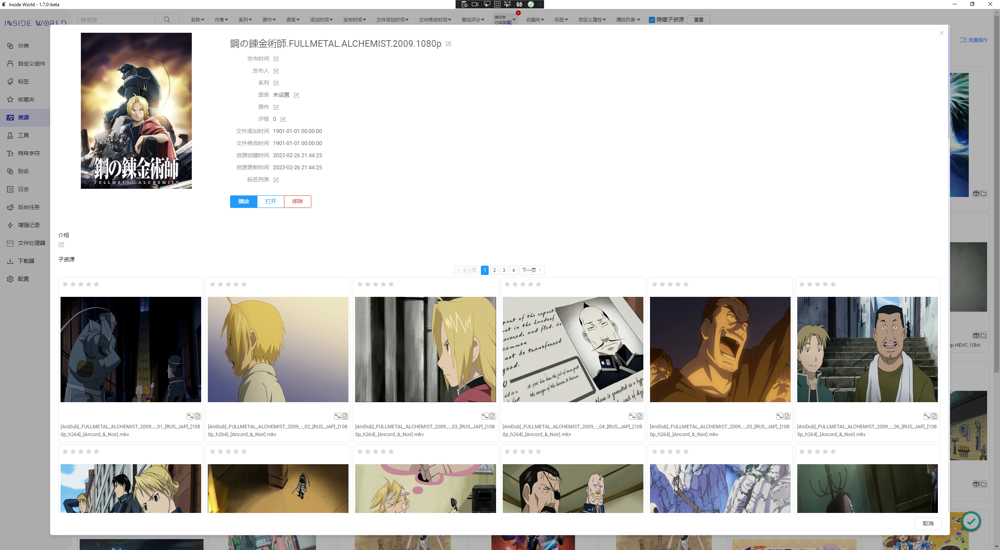

+ 如果当前资源有对应的文件，则会展示文件列表。
+ 双击文件夹将会进入子文件夹的文件列表。
+ 可以在右侧设置缩放比例。

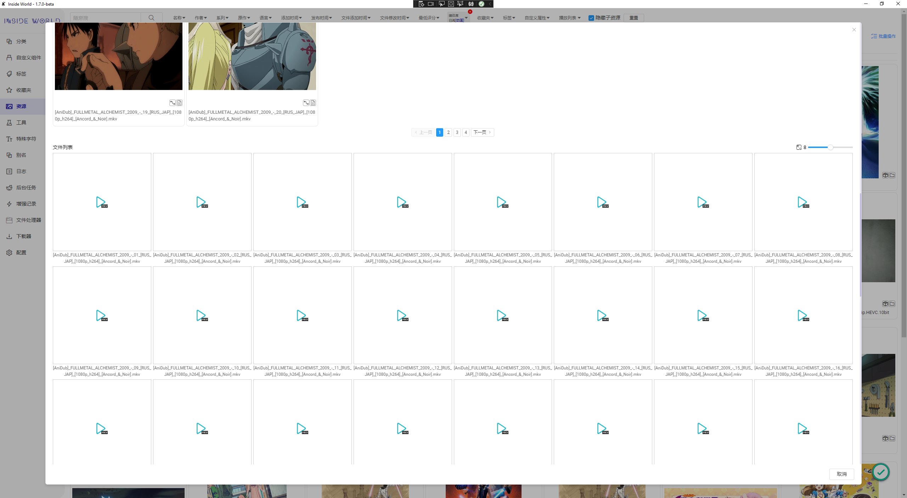

## 使用其他站点搜索(v1.6.2+)

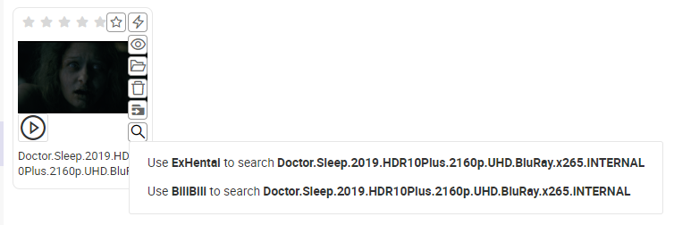
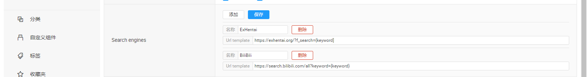

## 使用播放列表(v1.6.3+)

可以创建播放列表，通过软件自带的播放器连续播放，目前具备以下能力：

+ 可以创建多个播放列表
+ 可以加入一个资源
+ 可以加入一个资源的一个文件
+ 可以为音视频增加播放时间段

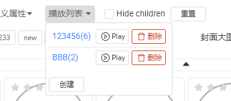
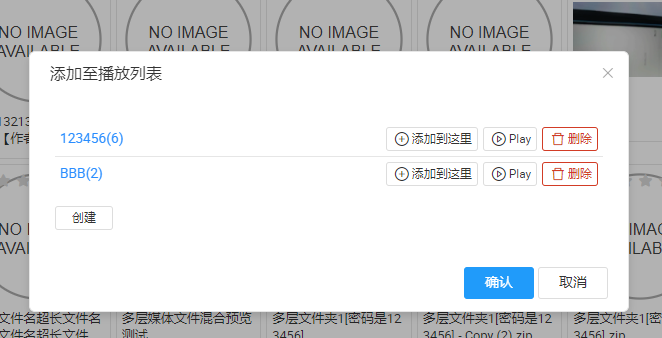