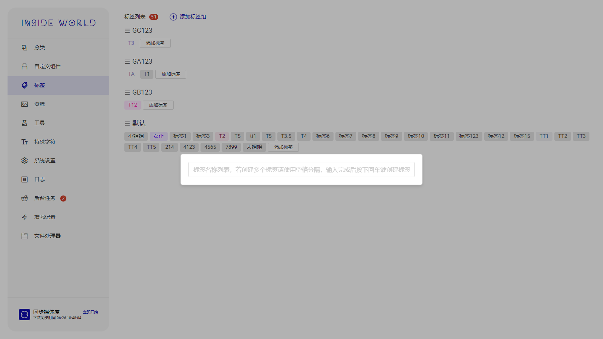
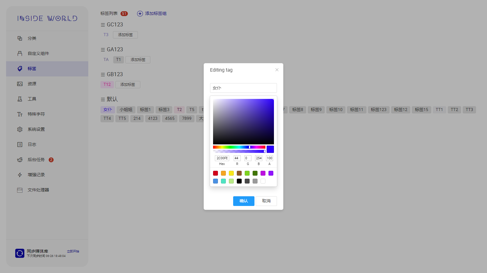
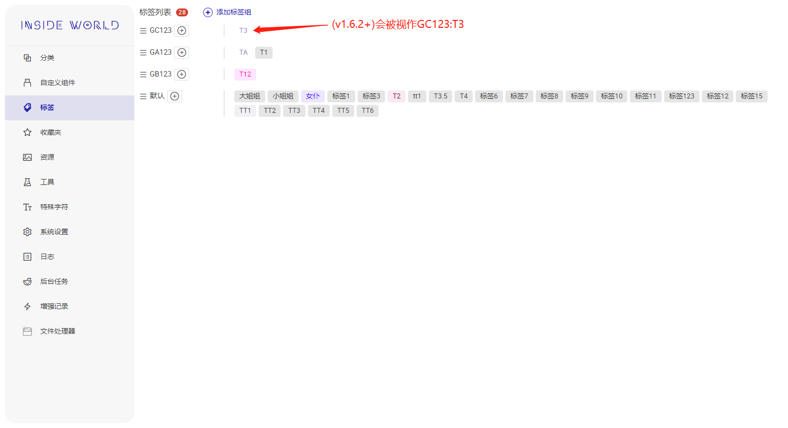
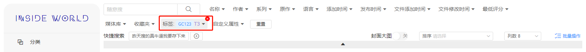
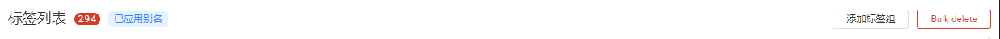
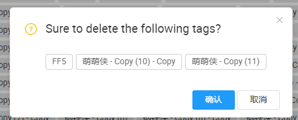

## 管理标签(v1.6.3+) <!-- {docsify-ignore} -->

**标签**和**标签组**均可以拖拽排序

## 标签组

从**1.6.2**版本开始，标签组名称将具有含义，不同标签组的同名标签将视作不同标签

## 批量删除(v1.7.0+)

可以在标签管理界面的右上角找到批量删除按钮

然后左键选择需要删除的标签，选择完成后再次点击右上角的删除按钮

确认删除即可

