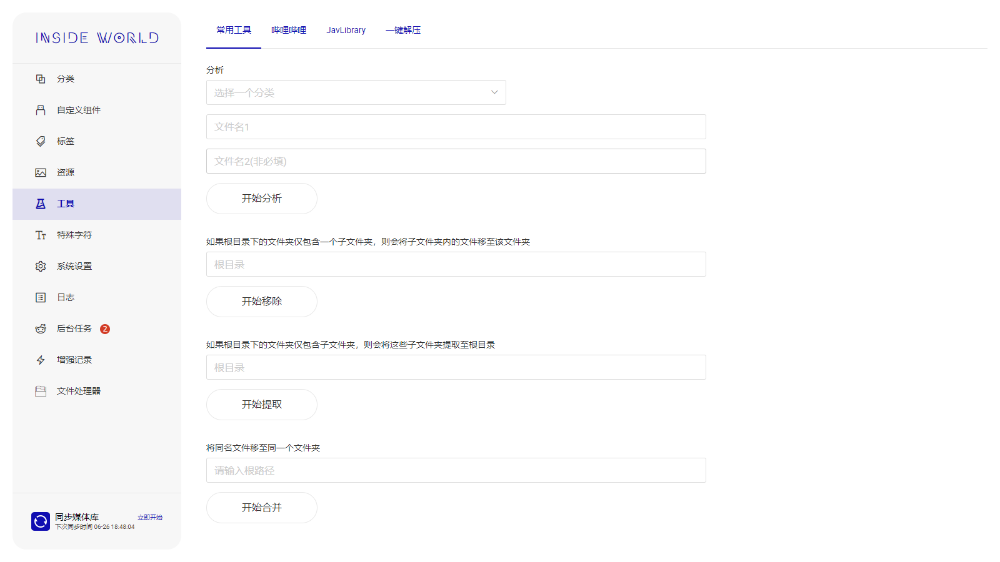
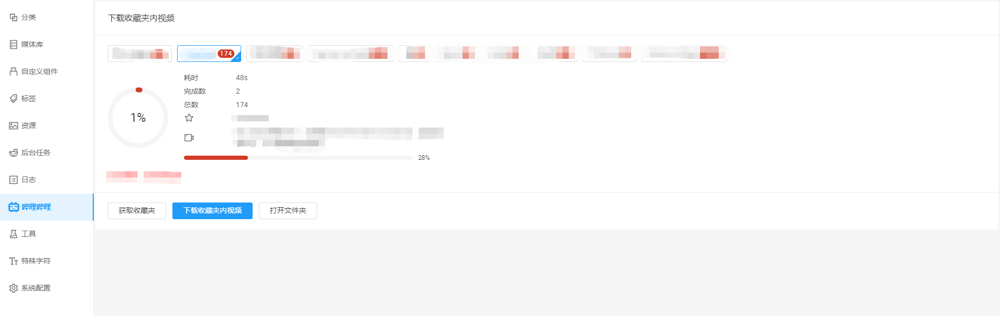
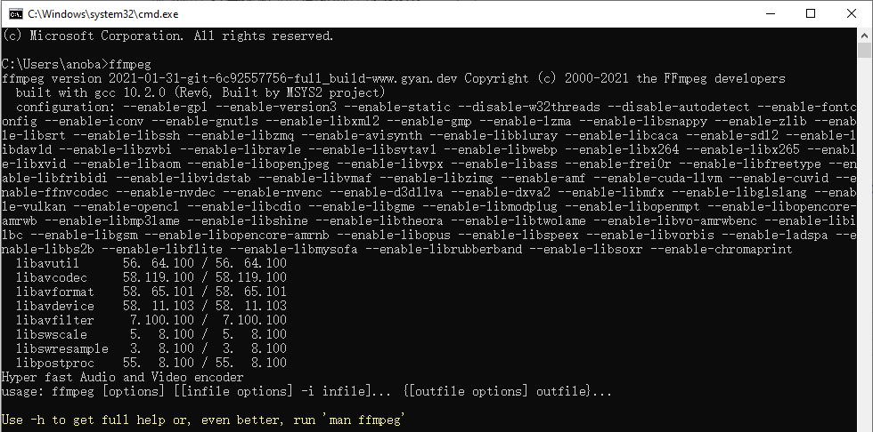
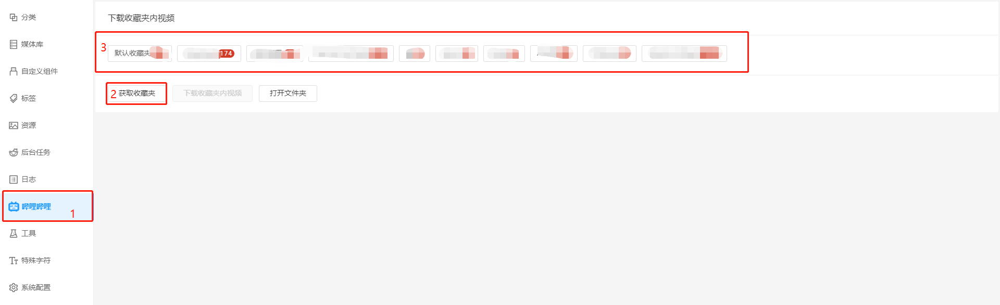
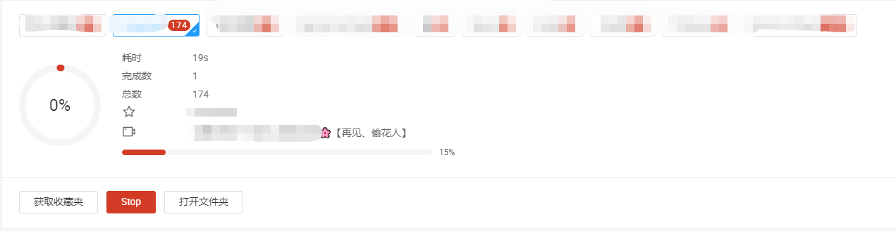
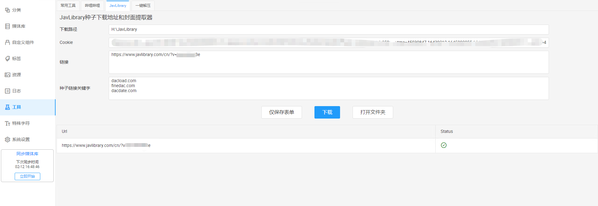
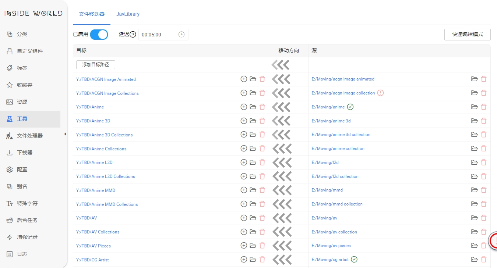

## 工具 <!-- {docsify-ignore} -->

## 常用工具

## 哔哩哔哩视频下载器

在1.7.0版本以后，该功能已被转移至[下载器](/guide/downloader)

批量下载收藏夹内所有视频的**最高清**版本，同时会保存弹幕和封面图

**该功能本质上是将人工逐项下载的操作自动化完成，短时间内频繁使用该功能会导致账号或ip被ban**

**准备环境**

+ 下载[FFmpeg](https://www.ffmpeg.org/)，用于视频音频合并，并确保ffmpeg.exe所在目录已被加入到系统环境变量中。打开命令行工具，执行ffmpeg，出现类似以下内容则说明配置成功

+ 启动本程序，配置哔哩哔哩Cookie与视频下载目录。[如何获取cookie](#common-cookie)

**获取收藏夹信息**

**下载视频**

+ 选择收藏夹
+ 点击下载视频
+ 下载进度会出现在收藏夹下方

**自动下载视频并将已下载视频转移至其他收藏夹(v1.6.2+)**

## 提取JavLibrary封面和下载地址

从**评论**中提取下载地址并下载**封面**

## ExHentai下载器(v1.6.3+)

填写对应信息后可以自动下载exhentai的资源，下载完成的资源链接会被移除

## 自动移动文件(v1.7.0+)

可以设置一批源文件路径以及目标文件路径，本程序将会自动将源文件路径内的文件(夹)移动至目标路径。

