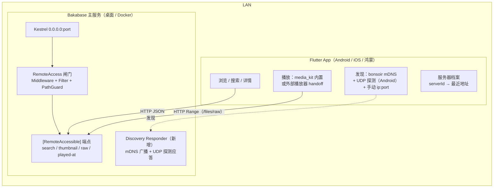

# Bakabase 双端 App（Flutter）设计文档

| 字段 | 值 |
|---|---|
| 状态 | M0–M4 已实施、M5 已出报告 — 见 §0 实施记录 |
| 分支 | `claude/bakabase-dual-platform-app-emytk3` |
| 最后更新 | 2026-08-29 |
| 依赖 | PR #1262（cross-device-resource-access，已合并） |
| 相关代码 | `src/modules/Bakabase.Modules.RemoteAccess/`<br>`src/apps/Bakabase.Service/Components/RemoteAccess/`<br>`src/apps/Bakabase.Service/Components/Playback/VideoDeliveryPlanner.cs`<br>`src/apps/Bakabase.Service/Controllers/FileController.cs`（`/files/raw`、`/files/play`、`/files/playability`）<br>`src/web/src/components/Resource/components/PlayOnThisDevice/playerSchemes.ts` |

---

## 0. 实施记录

### M0（服务端前置，issue #1263）

S1–S4 已按 §6 落地于 `Bakabase.Modules.RemoteAccess/Components/Discovery/`；mDNS 应答器为自实现精简版（未引第三方 DNS 库）。与原设计的偏差：

| 偏差点 | 原设计 | 实际实现 | 原因 |
|---|---|---|---|
| 文件流路由 | 文中写作 `/files/raw` 等 | 实际为 `/file/raw`、`/file/play`、`/file/playability`（`FileController` 路由是 `~/file`） | 原文笔误，以代码为准 |
| UDP 探测应答 | "回同样内容的 JSON" | 回 `BAKABASE_HERE_V1 {json}`（带前缀便于客户端过滤） | 协议明确化 |
| S5 Dart 生成管线 | gen-sdk 扩展 | 暂缓：M1 客户端手写薄封装（见下） | 端点面还小，避免过早引入生成器 |

### M1（App 骨架）

`src/apps/mobile/app/`（Flutter 3.47.2，CI 以此版本 pin）。发现（bonsoir mDNS + Android UDP 探测 + 手动输入）、协议版本握手、服务器档案、媒体库筛选 + 关键字搜索 + 资源网格 + 详情页均已落地。偏差：

| 偏差点 | 原设计 | 实际实现 | 原因 |
|---|---|---|---|
| 包结构 | `app/` + `packages/`（api/discovery/player 三包） | 单 app 包 + 分层目录（`lib/core`、`lib/discovery`、`lib/features`） | 单人维护三包纯开销；目录已按包边界切分，ohos/M2 需要时再机械拆出 |
| API 客户端 | swagger 生成并提交 | 手写 `BakabaseApiClient`（约 10 个端点的薄封装） | 同 S5 暂缓理由；模型字段名与 swagger 一致，迁移成本低 |
| M1 播放 | —（原计划 M2） | 详情页提供"复制流地址"（`/file/raw`）并上报 played-at | 不引入 media_kit 前的最小可用播放路径 |
| CI | 设想 ci.yml 加 paths-ignore | 未改 ci.yml；mobile-ci.yml 独立、path-filtered、不设 required | required check 不能 path-filter（不触发则永远 pending） |

### M2（播放）

内置 media_kit 播放器（直拉 `/file/raw`）、外部播放器调起（Android 用 `android_intent_plus` 构造真实 Intent 而非 Web 的 `intent://` 链接；iOS x-callback 深链 + `LSApplicationQueriesSchemes`）、漫画阅读器（压缩包条目走 `/file/play`）。所有播放路径统一上报 played-at。默认行为选择器为每次弹底部菜单，"记住选择"留待 M4+。

### M3（CI 与分发）

`mobile-release.yml`：tag `mobile-v*` 触发 → Android split-per-abi APK + macOS runner 出 unsigned IPA → GitHub Release → `scripts/mobile/build_sidestore_source.py`（stdlib、无状态：从全部 `mobile-v*` release 重建）生成 source.json 并强推到 `sidestore` 孤儿分支。SideStore 源地址：`https://raw.githubusercontent.com/anobaka/Bakabase/sidestore/source.json`。与原设计的偏差：source.json 不放 `docs/`（main 受分支保护，workflow 无法直推），改用独立无保护分支托管。

后续演进（同属 M3 范畴）：构建步骤抽成可复用的 `_mobile_build.yml`，三个入口共用——
1. `mobile-release.yml`（tag 正式发布，同上）；
2. `deploy.yml` 桌面发布管线：`mobile-changes` job 用 `git diff {上一个 v* tag}..HEAD -- src/apps/mobile scripts/mobile _mobile_build.yml` 判断 App 是否有改动，有则构建并把 APK/IPA 附到当次桌面 release 的 Assets（changelog 自动加移动端段落），无改动则跳过不打包——**这是移动端的常规发布路径**；
3. `mobile-dev-build.yml`（仅 workflow_dispatch，任意分支）：开发分支无 release 机制，产物以 Actions run artifacts + 阿里云 CDN 裸文件提供（合并前曾临时开过 claude/dev 分支 push 触发，合并时移除）。

分发收口于可复用的 `_mobile_distribute.yml`（上述 1、2 两路发布后共同调用）：镜像裸文件到 OSS `archives/{version}/`、按**资产名**（而非 tag）扫描全部 release 重建 SideStore 源、生成下载清单 `manifest.json` 上传到 OSS 固定路径并刷新 CDN。**下载地址发现机制**：服务端 `MobileAppDownloadService` 拉取该清单（带 cache-bust、1 小时缓存、离线降级），经 `GET /mobile-app/downloads`（`[RemoteAccessible]`）供 Web UI 的"移动 App"一级菜单页展示（双端版本、二维码、阿里云/GitHub 双链接、SideStore 源）。

### M4（打磨）

排序菜单（AddDt/PlayedAt/FileModifyDt/Filename + 方向）、播放历史页（`/play-history` + `/resource/keys` 批量解析标题封面）、详情页评分（读 `properties[2][13]`，写 `PUT /resource/{id}/property-value`）、服务器切换（断开回连接页，档案一键直连）。服务端配套：`PutResourcePropertyValue` 标记 `[RemoteAccessible]`（属性写入落库不落屏，符合该标记语义；单端点放开，bulk 写仍 host-only）。S6（精简搜索 ViewModel）未做——待真机实测数据量再决定。

### M5（鸿蒙）

技术验证报告见 [`mobile-harmonyos-report.md`](./mobile-harmonyos-report.md)。结论维持 Later：fork 工具链落后（3.27-ohos vs 我们的 3.47）、media_kit 无稳定 ohos 支持是主要阻塞；UDP 探测通道与 discovery/playback 实现边界让未来适配保持为"加一个平台实现"。报告中列出了重新立项的触发条件。

---

## 1. 目标与非目标

### 功能边界：分层能力对等（2026-08-30 起取代"薄展示层"的一刀切表述）

目标改写为**能力可达对等**：手机上一切功能可达，常用的做成原生体验，长尾走浏览器。

| 层级 | 内容 | 实现 |
|---|---|---|
| T1 消费环 | 浏览/搜索/播放/阅读/历史/评分 | 原生，持续打磨 |
| T2 轻管理 | 属性编辑、保存的搜索、置顶等轻操作 | 原生，按触屏交互逐个重设计 |
| T3 桌面工作流 | 文件处理器、批量修改、增强器/下载器配置等 | App 内"打开完整 Web 界面"直达系统浏览器 |

**晋升规则**：T3 中被手机端高频使用的功能，按触屏交互原生重做后晋升 T2；判据是真实使用而非预判。**功能入原生的门槛**（三条不满足就留在浏览器）：手机上高频；只读或轻写；有合适的触屏交互形态。

**安全前置**：当前沿用"内网即可信"（无认证），T2 的写操作面因此刻意收窄（单条属性写入级别）。若未来扩权到批量写入/删除/配置级别，先做远程认证再扩。

> **补充（2026-09-09）**：桌面纯客户端设计引入设备配对之后，移动端也会切换过去（决策已定）。落地时有一条必须写进 UI：**配对之后的能力天花板等于 `Unrestricted`**——也就是除标记了「必须在用户机器上执行」的端点之外全部可用。配对不是在现有权限上再加一层限制，而是把今天那 52 个端点的天花板抬到全量。
>
> 反过来也有一条约束：在服务端已经是 `Unrestricted` 的部署里（Docker 默认就是），未配对本来就已经是全量，**此时不要提示用户配对**——那是一个没有任何收益的步骤。

### 目标

- **纯展示层瘦客户端**：浏览资源、播放资源、少量轻操作（标记已播放、评分等）。所有状态、索引、元数据、转码能力都在主服务端。
- **不能独立存在**：App 启动即进入"找服务器"流程，没有可连接的 Bakabase 主服务就没有任何功能。
- **内网自动发现**：打开 App 自动找到局域网内的 Bakabase 服务端，手动输入 `ip:port` 仅作兜底。
- **复用 #1262 的中转能力**：播放走服务端已有的 `[RemoteAccessible]` 流式端点（`/files/raw` 直传 + Range seek），端侧原生解码，**不走网页播放器**，不依赖服务端转码。
- **Flutter 双端 + CI**：Android（APK 直发 + GitHub Release）、iOS（SideStore 分发 unsigned IPA）。
- **鸿蒙留口**：架构上把平台相关能力（发现、播放、分发）隔离成可替换实现，鸿蒙作为后续独立里程碑。

### 非目标（明确不做）

媒体库管理、Path Mark、Enhancer、下载器、批量修改、文件处理器、配置管理、BTask 管理、任何写文件系统的操作。这些永远留在桌面端/Web 端。

---

## 2. 现有服务端能力盘点（#1262 之后）

这是 App 设计的地基，均已验证过代码：

### 2.1 信任模型

- `RemoteAccessMode`：`Disabled`（桌面默认）/ `Enabled` / `Unrestricted`（Docker 默认）。**无设备身份、无配对、无 TLS** —— 能连上端口即被信任，LAN 本身是安全边界（85e2c05 有意删除了配对方案）。
- 双层闸门：`RemoteAccessMiddleware`（外层，loopback 直通 + host-only 路径前缀）+ `RemoteAccessAuthorizationFilter`（内层，MVC action **默认拒绝**，仅 `[RemoteAccessible]` 标记的端点可远程调用）。
- 路径守卫：`[RemoteAccessible(PathParameters=...)]` 声明的路径参数经 `MediaPathGuard` 校验，只允许媒体库 / Path Mark / AppData 缓存根之下的文件。
- 拒绝响应带 `X-Bakabase-Remote-Access: {DenialReason}` 头（`Disabled` / `HostOnly` / `PathNotServable`），App 可据此给出准确提示。

### 2.2 App 可直接复用的远程端点（现存 `[RemoteAccessible]`）

| 用途 | 端点 |
|---|---|
| 远程上下文 | `GET /remote-access/context`（IsLocal + Mode） |
| 媒体库列表 | `MediaLibraryV2Controller` 的读端点 |
| 资源搜索 | `POST /resource/search`（分页 + 过滤 DSL）、`POST /resource/search/ids`、`GET /resource/keys` |
| 资源详情 | 详情/`hierarchy-context`/`previewer`/属性读取 |
| 可播放文件 | `GET /resource/{id}/playable-items` |
| 封面/缩略图 | `GET /tool/thumbnail?path=&w=&h=`（30 分钟响应缓存） |
| 文件直传 | `GET /files/raw?fullname=`（**Range 支持 → 可 seek**，MIME 如实，零转码） |
| 浏览器播放/压缩包条目 | `GET /files/play?fullname=`（zip 条目流式提取；视频经 `VideoDeliveryPlanner` 决定直传/remux/转码） |
| 播放能力探测 | `GET /files/playability?fullname=`（ffprobe：媒体类型、编解码、时长、分辨率） |
| 播放上报 | `POST /resource/{id}/played-at?item=`（远程播放写播放历史专用） |
| 播放历史 | `PlayHistoryController` 读端点 |
| 属性/自定义属性读取 | `PropertyController`、`CustomPropertyController` 读端点 |
| 属性写入 | `PUT /resource/{id}/property-value`（评分等轻操作可用） |

Host-only（App 永远不调）：`/resource/{id}/play`、`/play-item`（在主机上拉起播放器）、打开目录、删除、`/remote-access/settings` 等。

### 2.3 播放中转现状

- `playerSchemes.ts` 已沉淀"把 HTTP 流交给原生播放器"的完整知识：Android `intent://`（VLC/MX/mpv/系统选择器）、iOS x-callback（VLC/Infuse/nPlayer/SenPlayer）、桌面 IINA/PotPlayer 等。App 侧要做的是把这份映射移植成 Dart（App 内不受浏览器限制，Android 可直接构造 Intent）。
- `VideoDeliveryPlanner` 只服务**浏览器**场景（h264 白名单 + 浏览器容器判断）；原生播放器场景不需要它 —— 直接 `/files/raw`，MKV/HEVC/DTS 全部端侧解码。
- ⚠️ `RemoteAccessOptions.AllowLiveTranscode` 已定义（默认关）但**尚未在任何地方生效**——`/files/play` 的转码分支目前不检查它。见 §6 服务端待办。

### 2.4 网络与端口

- Kestrel 始终绑定所有网卡（`RemoteAccessMode` 注释明确：Disabled 只是拒绝请求，不是不监听）。
- 端口以运行时实际监听为准（`AppContextListeningAddressProvider` 读 Kestrel 上报的地址）→ **发现协议必须携带端口，不能假定固定端口**。
- `RemoteAccessService.GetReachableAddresses()` 已会枚举可路由的本机 IPv4 地址，发现广播可直接复用。
- 无 TLS，全程 `http://`。

---

## 3. 系统架构



App 与服务端唯一的通道是 HTTP（外加发现期的 mDNS/UDP）。不用 SignalR（`/hub/ui` 面向 Web GUI 的全量推送，瘦客户端拉取即可，V1 明确不接）。

---

## 4. 服务发现与连接

### 4.1 协议

**主通道：mDNS/DNS-SD**，服务类型 `_bakabase._tcp.local.`，TXT 记录：

| Key | 含义 |
|---|---|
| `id` | 服务器持久唯一 ID（GUID，首次生成后存入 `remote-access` options） |
| `name` | 展示名（默认机器名） |
| `port` | 实际监听端口 |
| `ver` | 应用版本（nbgv 版本号） |
| `proto` | 远程协议版本，整数，从 `1` 起 |

**辅通道：UDP 单播/广播探测**（仅 Android/鸿蒙客户端使用，见下面 iOS 约束）：App 向 `255.255.255.255:33333`（端口待定，写入常量）广播 `BAKABASE_DISCOVER_V1`，服务端回同样内容的 JSON（id/name/port/ver/proto）。作用：mDNS 被路由器过滤时的兜底 + 连接诊断工具。

**广播开关跟随 RemoteAccessMode**：`Disabled` 不广播不应答；`Enabled`/`Unrestricted` 开启。选项变化经 `IBOptionsManager<RemoteAccessOptions>` 监听即时生效。

### 4.2 iOS 平台约束（决定了上面的双通道设计）

- 经平台 API 的 Bonjour 浏览（`NWBrowser`/`NsdManager`，Flutter 侧 `bonsoir` 或 `nsd` 包）只需要 Info.plist 声明 `NSBonjourServices`（列出 `_bakabase._tcp`）+ `NSLocalNetworkUsageDescription`，**不需要** multicast entitlement，SideStore 侧载可用。
- 纯 Dart 的 `multicast_dns` 包和自定义 UDP 广播走原始 socket，需要 `com.apple.developer.networking.multicast` 受限 entitlement——免费 Apple ID 侧载拿不到。**所以 iOS 只用 bonsoir，UDP 探测通道在 iOS 上禁用。**
- 首次发现会触发 iOS "本地网络"权限弹窗，拒绝后 mDNS 静默失败 → 手动输入兜底必须始终可达，且失败提示要引导用户去系统设置开权限。

### 4.3 连接生命周期

1. 启动 → 并行：mDNS 浏览（+Android UDP 探测）+ 尝试上次成功的服务器地址。
2. 发现多台 → 按 `id` 列出让用户选；单台 → 自动连。
3. 连上后调 `GET /remote-access/context`：
   - 收到 `Disabled` 拒绝（`X-Bakabase-Remote-Access: Disabled`）→ 提示"在主机上开启远程访问"。
   - `proto` 大于 App 支持的最大版本 → 提示升级 App；小于最低支持 → 提示升级服务端。
4. 按 `id` 记住服务器档案（名称、最近 N 个成功地址、上次连接时间）。IP 变了但 `id` 没变 → 无感切换。
5. 会话中请求连续失败 → 回到发现流程（服务器可能换了 IP 或下线）。

### 4.4 安全立场

跟随主项目：**不发明配对/认证**，LAN 即边界，与 #1262 的决策一致。文档与 UI 明示："任何能连上你网络的设备都能访问媒体库"。

> **更正（2026-09-09）**：本节原写"App 的 HTTP 客户端统一走一个拦截器管道，未来服务端若加 token/TLS，只改一处"。核对代码后不成立，§7.1 也有同样的说法：
>
> - `core/api_client.dart` 里的 Dio 实例**没有注册任何拦截器**，`baseUrl` 与拒绝原因解析是写在私有 `_request` 方法里的，不是管道。
> - 四个媒体地址构造器（缩略图、原始文件、播放、流）**完全绕过 Dio**——地址被直接交给 `CachedNetworkImage` 与 media_kit，请求由它们自己发出。libmpv 甚至会自行发起 Range 子请求，App 既看不到也拦不到。
>
> 所以桌面纯客户端设计里的设备配对要落到移动端时，**不是"只改一处"**：JSON 调用可以补一个签名拦截器，但媒体地址那条路必须改用签名地址（见 `pc-client-design.html` §7.5），两条路要分别处理。

---

## 5. 播放设计

### 5.1 视频

| 优先级 | 方式 | 说明 |
|---|---|---|
| 默认 | **内置播放器 media_kit（libmpv）直拉 `/files/raw`** | Range → 完整 seek；MKV/HEVC/DTS/FLAC 端侧硬解；服务器零 CPU。这正是"用中转方案、不用网页播放"的落点 |
| 可选 | **外部播放器 handoff** | 移植 `playerSchemes.ts`：Android 直接构造 `Intent`（`android_intent_plus`，比 Web 的 `intent://` 链接更可靠）；iOS 拉起 `vlc-x-callback://`、`infuse://` 等（`url_launcher`）。设置里让用户选默认行为 |
| 兜底 | `/files/play`（服务端 remux/转码） | 仅当端侧真解不动时手动触发；依赖服务端接通 `AllowLiveTranscode`（§6），V1 不承诺 |

播放开始即 `POST /resource/{id}/played-at?item={file}`（fire-and-forget，与 Web 端 `PlayOnThisDevice` 行为一致）。

### 5.2 图片 / 漫画

- 网格与封面：`/tool/thumbnail?path=&w=&h=`（带尺寸参数，命中服务端响应缓存）。
- 阅读器：`playable-items` 里的图片列表 → 翻页阅读器（预加载前后页，原图走 `/files/raw`；**压缩包内条目走 `/files/play`**——`raw` 故意不支持压缩包）。漫画（zip/文件夹图集）是 Bakabase 的高频场景，阅读器按 V1 正式功能对待，不是附赠。

### 5.3 音频 / 文本

- 音频：media_kit 同一播放器栈，直拉 `/files/raw`。
- 文本：V2 再说（`/files/play` 可取内容，优先级低）。

### 5.4 已知限制（如实告知用户）

- 压缩包内视频：`/files/play` 是管道流，**不可 seek**。V1 标注"存档内视频仅支持顺序播放"。
- 外部播放器无法回报播放进度/结束事件（Web 端同样如此），只记"播放过"。

---

## 6. 服务端待办（全部在现有惯例内）

| # | 事项 | 位置 | 说明 |
|---|---|---|---|
| S1 | **Discovery Responder** | `Bakabase.Modules.RemoteAccess/Components/Discovery/`（新增） | 常驻 hosted service：mDNS responder + UDP 探测应答；watch `RemoteAccessOptions` 决定开关。mDNS 库选型：优先自实现精简 responder（只答一种服务类型，避免引入维护不善的依赖），备选 `Makaretu.Dns.Multicast` |
| S2 | **ServerId 持久化** | `RemoteAccessOptions` 增加 `ServerId`（GUID，首次启动生成） | 走既有 `[Options(fileKey: "remote-access")]` 机制 |
| S3 | **`GET /remote-access/server-info`** `[RemoteAccessible]` | `RemoteAccessController` | 返回 id/name/appVersion/protocolVersion/capabilities；与 TXT 记录同源。改完跑 `yarn gen-sdk` |
| S4 | **接通 `AllowLiveTranscode`** | `FileController.Play` 转码分支 | 远程请求 + 选项关闭 → 拒绝并返回明确 reason，让 App 引导用户用外部播放器。目前该选项是死配置 |
| S5 | **swagger.json 供 Dart 生成** | `src/web/tools/gen-sdk.js` / `Bakabase.Cli` | 管线已离线产出 swagger.json（`.sdk-cache/`），加一步把它喂给 openapi-generator（dart-dio），产物提交进 mobile 工程，规则同 Web SDK：**只生成，永不手改** |
| S6 | （V2）远程搜索精简 ViewModel | `ResourceController` | 现有 search 返回全量 Properties，移动端列表页可能过重；先实测再决定 |

S1–S3 是 App 可用的前置条件（M0），S4–S6 可后置。

---

## 7. Flutter 工程设计

### 7.1 位置与结构

```
src/apps/mobile/                  # 与 apps/Bakabase 并列，monorepo 内
  app/                            # Flutter 应用本体
    lib/
      features/                   # discovery / library / search / detail / player / settings
      core/                       # 服务器档案、HTTP 客户端（baseUrl 与 denial-reason 解析写在 _request 里，**不是**拦截器管道——见 §4.4 更正）
  packages/
    bakabase_api/                 # openapi-generator 从 swagger.json 生成（提交，不手改）
    bakabase_discovery/           # 发现抽象 + bonsoir 实现 + UDP 实现（平台可替换 ← 鸿蒙留口）
    bakabase_player/              # 播放抽象 + media_kit 实现 + 外部播放器 handoff（同上）
```

### 7.2 关键选型

| 关注点 | 选型 | 理由 |
|---|---|---|
| 状态管理 | Riverpod | 主流、可测、无 BuildContext 依赖 |
| API 客户端 | openapi-generator（dart-dio）产物提交 | 与 Web SDK 同一 swagger 源、同一"生成不手改"纪律 |
| 发现 | `bonsoir`（iOS/Android 平台 NSD API） | 唯一能在 SideStore 侧载 iOS 上合法工作的路线（§4.2） |
| 播放 | `media_kit` 全家桶 | libmpv：MKV/HEVC/DTS 全覆盖；`video_player` 在 iOS 上 HEVC 有黑屏问题，不适合媒体服务器场景 |
| 图片 | `cached_network_image` | 缩略图本地缓存 |
| 明文 HTTP | Android：`usesCleartextTraffic=true`（或 network security config 放行私网段）；iOS：ATS `NSAllowsLocalNetworking` | 服务端无 TLS，必须显式放行 LAN 明文 |

### 7.3 版本策略

**App 版本独立于 `version.json`**（桌面 nbgv 管桌面）。App 用自己的 pubspec 版本 + `mobile-v*` tag 发布。兼容性靠 `proto` 协议版本握手（§4.3）保证，不靠版本号对齐——App 和服务端的发布节奏注定不同。

---

## 8. CI 与分发

### 8.1 `mobile-ci.yml`（PR 门禁）

```yaml
on:
  pull_request:
    paths: ["src/apps/mobile/**"]
```

jobs（全部 ubuntu）：`flutter analyze` → `flutter test` → `flutter build apk --debug`。

⚠️ 不要把它设为 branch protection 的 required check：path-filtered workflow 在没碰 mobile 的 PR 上不触发，required check 会永远 pending。若要门禁，用 `dorny/paths-filter` 在单一 workflow 内跳步，或接受非 required。现有 `ci.yml` 反向加 `paths-ignore: ["src/apps/mobile/**", "docs/**"]` 可省桌面流水线。

### 8.2 `mobile-release.yml`（tag `mobile-v*` / 手动）

| Job | Runner | 产物 |
|---|---|---|
| android | ubuntu | `flutter build apk --release --split-per-abi`（media_kit 的 libmpv 每 ABI ~30MB，必须分包）+ 可选 aab |
| ios | **macos** | `flutter build ios --release --no-codesign` → 打包 **unsigned IPA**（`Payload/` 目录 zip）|
| publish | ubuntu | 建 GitHub Release（tag `mobile-v{version}`）挂 APK + IPA；**更新 SideStore source.json 并提交**（托管于 GitHub Pages 或 raw URL） |

### 8.3 SideStore 分发

- source.json 用 AltStore 源格式（`name` / `identifier` / `apps[].bundleIdentifier` / `apps[].versions[]{version, date, downloadURL, size, minOSVersion}`），`downloadURL` 指向 GitHub Release 的 unsigned IPA。用户在 SideStore 添加源后，本机用自己的 Apple ID 签名安装。
- 如实告知限制：免费 Apple ID **3 个 App 上限、7 天重签**（SideStore 可在同一 Wi-Fi 下后台自动刷新）；App 不依赖任何受限 entitlement（§4.2 的设计正是为此）。

### 8.4 鸿蒙：结论 = Later（V1 后独立里程碑）

- 路线存在：OpenHarmony-SIG 的 `flutter_flutter` fork（Gitee）可编 ohos 目标，需 DevEco Studio / API 12 工具链。
- 但插件生态是硬缺口：`media_kit`、`bonsoir` 都没有 ohos 实现——播放要换 ohos 视频插件或纯外部播放器 handoff，发现要用 UDP 探测通道（正好 §4.1 已设计）。CI 也需要自定义鸿蒙构建环境。
- **架构上现在就付的成本只有一条**：`bakabase_discovery` / `bakabase_player` 做成抽象 + 平台实现（§7.1 已包含）。其余到 M5 再投入，不让鸿蒙拖慢双端首发。

---

## 9. 里程碑

| 里程碑 | 内容 | 交付判据 |
|---|---|---|
| M0 服务端前置 | S1 发现广播 + S2 ServerId + S3 server-info + S5 Dart 生成管线 | 手机浏览器输入发现到的地址能打开 Web UI |
| M1 连接与浏览 | 发现/连接/服务器档案；媒体库 → 资源网格（缩略图）→ 详情（属性只读） | 断网重连、IP 变化、Disabled 提示全部可演示 |
| M2 播放 | 图片/漫画阅读器；视频 media_kit + 外部播放器 handoff；played-at 上报 | MKV/HEVC 内网直播放可 seek；播放历史在 Web 端可见 |
| M3 CI 与分发 | mobile-ci / mobile-release / SideStore source.json | 从 tag 到 SideStore 可安装全自动 |
| M4 打磨 | 搜索过滤、播放历史页、评分、多服务器切换、S4 转码兜底 | — |
| M5 鸿蒙探索 | ohos 目标编译、插件替换评估 | 先出技术验证报告再排期 |

---

## 10. 风险与开放问题

| 风险 | 应对 |
|---|---|
| 无认证模型被 App 放大（更多设备、更容易连） | 跟随主项目立场，UI 明示边界；HTTP 管道预留 token 注入点（§4.4） |
| 路由器 AP 隔离 / 组播过滤 → mDNS 失效 | UDP 探测（Android）+ 手动输入 + 档案记忆四重兜底（§4.3） |
| iOS 本地网络权限被拒 → 发现静默失败 | 权限引导页 + 手动输入常驻 |
| Docker 部署 mDNS 需 host network | 文档注明；bridge 网络下靠手动输入 |
| media_kit 包体积 | split-per-abi；iOS 无此问题 |
| 免费 Apple ID 7 天过期 | SideStore 自动重签 + 文档说明；不承诺规避 |
| search 全量 DTO 移动端过重 | M1 实测，必要时做 S6 |
| 开放：App 内是否要"随机播放"入口？ | 服务端 `play/random` 是 host-only（在主机拉起播放器），App 侧需要不同语义（随机挑一个资源本机播），V2 讨论 |

---

## 附：与需求的对照

| 需求 | 落点 |
|---|---|
| 尽量薄的展示层 | §1 目标、§5 播放全走服务端已有端点、零新业务逻辑下沉 App |
| 不能独立存在 + 内网自动发现 | §4 双通道发现 + 连接生命周期 |
| 大部分功能不出现在 App | §1 非目标清单 |
| Flutter 双端 + CI + SideStore | §7 工程、§8 CI/分发 |
| 鸿蒙 | §8.4：Later，但 §7.1 的抽象现在就为它留口 |
| 基于刚 merge 的中转能力、不用网页播放 | §2 能力盘点、§5.1 默认 media_kit 直拉 `/files/raw`（原生解码，非 Web 播放器） |
